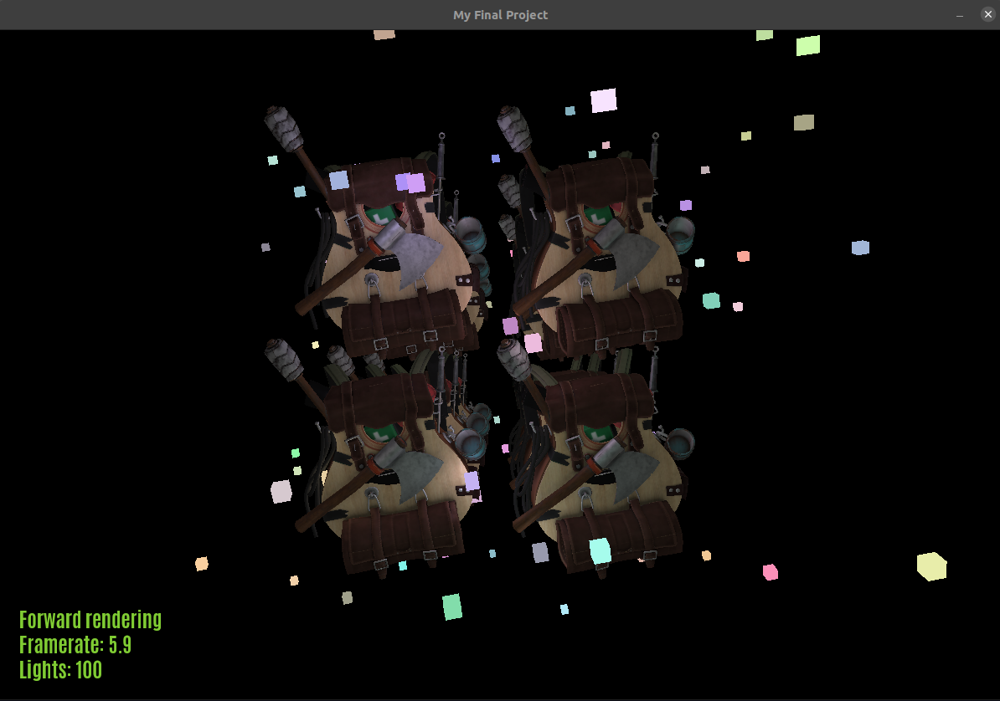
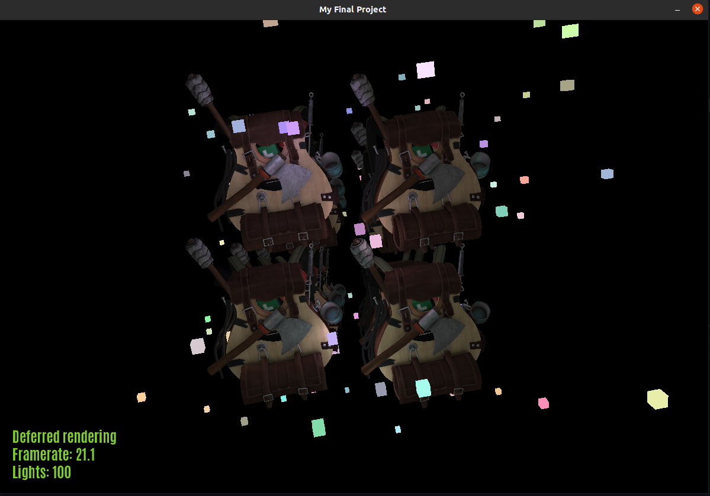
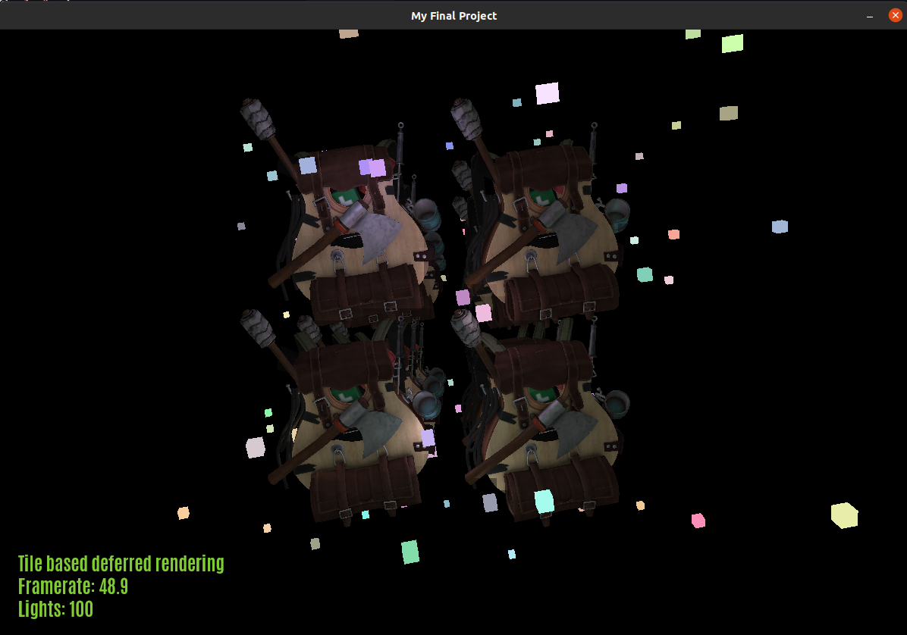

## *Requires lib assimp to build* 
```
sudo apt install libassimp-dev
```

### Features

* WASD keyboard movement
* hold shift for mouse look
* zoom with mouse wheel
* x-key switches between forward rendering and deferred rendering
* z-key allows inspection of deferred rendering frame buffers, f-key to cycle through the buffers
* When in deferred rendering mode, hit c-key to turn on tile based deferred rendering
* When in tile-based deferred rendering, hit t-key to transpose tile boundaries over scene


### Youtube video

* Sorry for the sound quality! Tried a few mics and they were all terrible, the program is pretty taxing on my poor little laptop so the fan noise gets pretty loud

https://youtu.be/S-fF5R1jeBc







